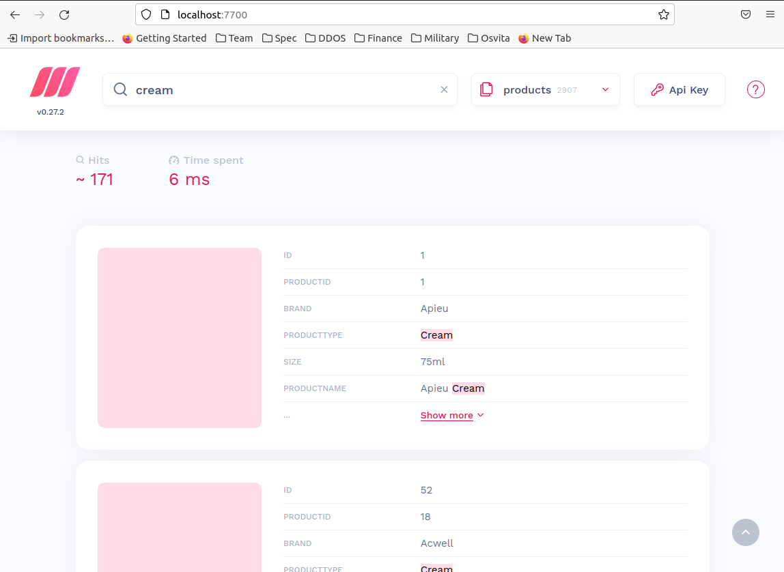
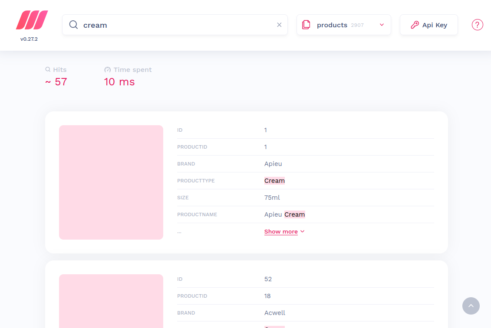

# meilisearch-distinct-documents

## Here you can find:
 - [Environment](#environment)
 - [Dataset](#dataset)
 - [Meilisearch configs](#configs)
 - [Test case](#test-case)
 - [Start this project](#start-this-project)
  

## Environment

- meilisearch version: `0.27.2`
- meilisearch-js version: `0.25.1`
- programming language: `Java Script`
  

## Dataset

Dataset was automaticaly generated. It presents `969` unique product items. Each product item has `3` variations (size: 75ml, 150ml, 1000ml). Therefore total count of documents is `969 products * 3 sizes = 2907 documents`.

JSON-file with full dataset you can see [here](src/data/dataset/dataset.json)
  

## Configs

 - index name: `'products'`
 - primary key: `'id'`
 - distinct attribute: `'productId'`

 Here're files with [settings](src/meili/const/index.js) and [miggration code](src/meili/migration/index.js)
  

## Test case

- [Run](#start-this-project) meilisearch
- Open meilisearch inside a browser
- Select the `products` index
- Enter searching word `cream`

You will see `171 hits`. It shows a number of all documents relevant this search. But the correct result is `57 hits` (171 document/3 sizes = 57 unique product items).

- Scroll down and click the `Load more` button until the last page (3rd page).

- Scroll up and you will see `57 hits`. Now it shows the correct value.

  

## Start this project

- install `docker` and `docker-compose`
- install `node.js` and `npm`
- run `git clone`
- run `cd <project name>`
- install the mailisearch package, run `npm i` 
- starting docker-compose with meilisearch inside, run `docker-compose up -d meilisearch`
- create an index, run `npm run meili:migrate`
- load dataset into meilisearch, run `npm run meili:load`
- open `http://localhost:7700` in your browser
  
